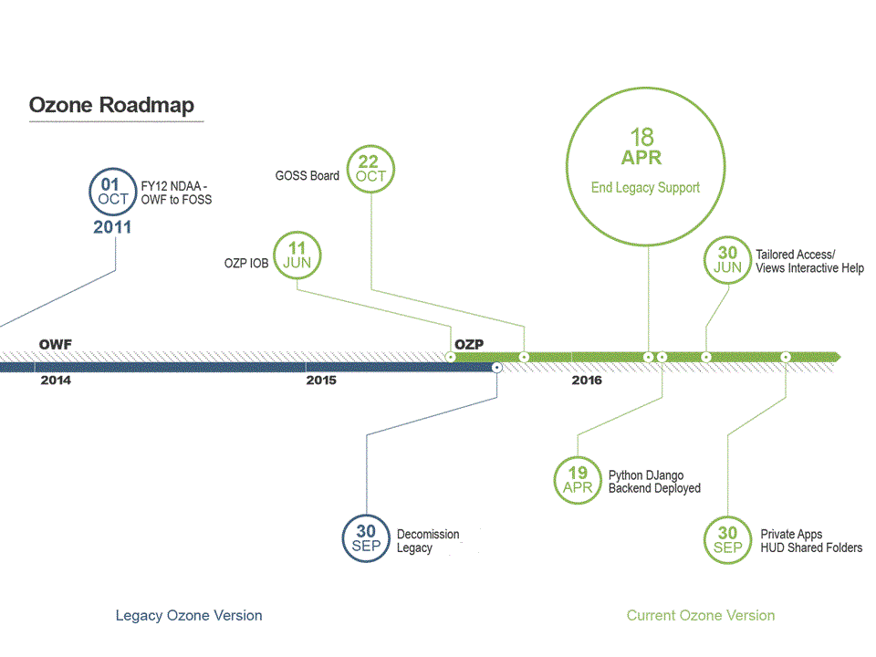

OZONE Platform Documentation
============================

This repository contains guidelines, standards and documentation for the OZONE Platform. This guidance is designed to reflect the need for standardization across coordinated development teams and the community as the software grows and matures over time, and will be used as a checklist for pull request approvals and other control gates. 

**General Documentation:**  
http://ozone-development.github.io/ozone-website/  
https://github.com/ozone-development/ozp-documentation/wiki  
https://github.com/ozone-development/ozp-documentation/tree/master/Documentation

**Developer Setup**  
https://github.com/ozone-development/ozp-documentation/wiki/Developer_Setup

**IWC Documentation:**  
http://ozone-development.github.io/ozp-iwc/  
http://ozone-development.github.io/ozp-iwc/FAQ.html

**OZP Release Info:**  
https://github.com/ozoneplatform/ozp-releases

**OZP Backend**  
https://github.com/ozone-development/ozp-backend

**OZP Wiki**
https://github.com/ozone-development/ozp-documentation/wiki

OZP Pull Request
==============================
The OZONE Platform team is excited to have the opportunity to receive pull request from the community.  Pull request should be submitted following the Fork & Pull guidance in [GitHub Help] (https://help.github.com/articles/using-pull-requests/). We request that pull request be submitted in small chunks as to limit the review and integration time commitment from our team.

RoadMap
===============================

